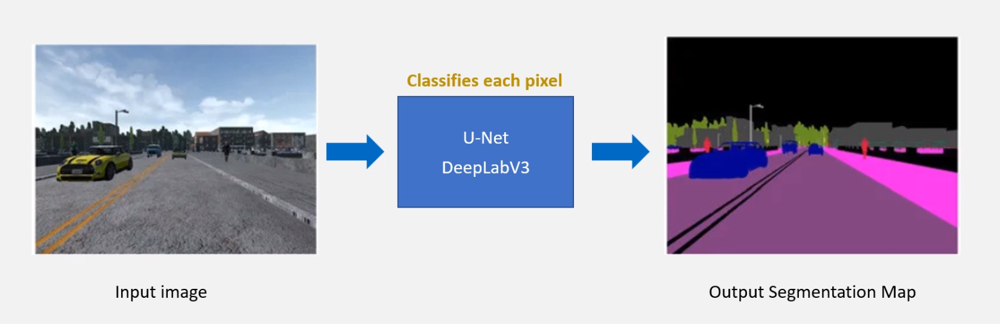
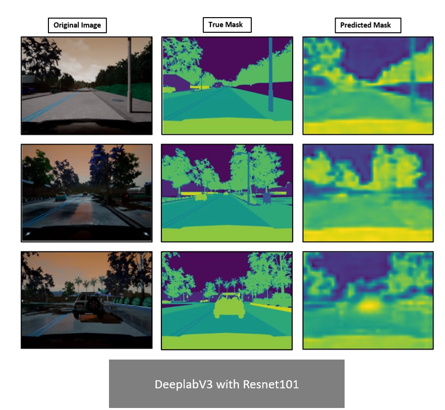
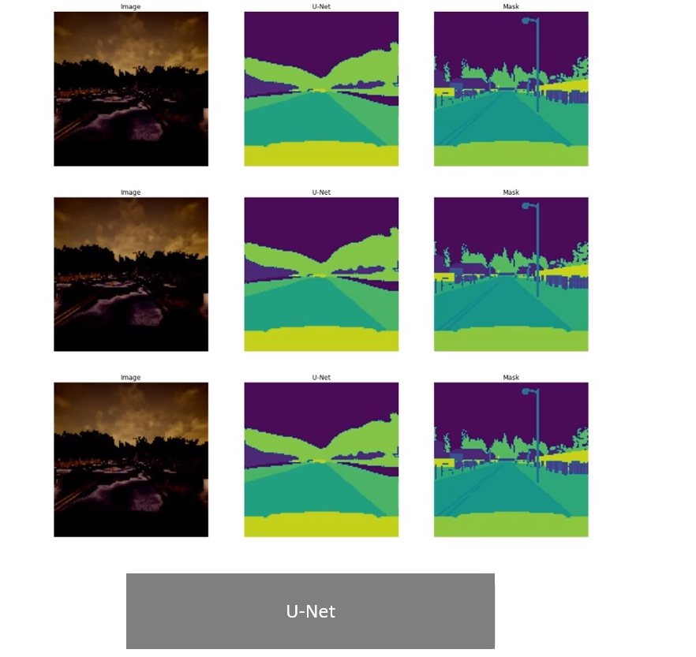

# Deep Learning for Semantic Segmentation of CARLA Simulator Data

## Objective:
- The main aim of the project is to analyze and compare the segmentation outcomes achieved using both the U-Net and DeepLabV3 models. Additionally, modifications have been made to these conventional networks, and a comparative analysis has been conducted

      

 

  
  

